# Out-of-Band Management

## Version 2

See the `v2/` directory for the second version of this project. It replaces the esp32 with a Raspberry PI Pico (rp2040) with a W5500 for Ethernet.

## Story

I do not use any enterprise servers in my homelab, instead primarly consumer parts. Rarely do any consumer or prosumer boards have OOB/IPMI except for some overpriced Asrock boards, so I have no true out-of-band management like IPMI/ILO/etc. I do have an IP-KVM which provides video, HID, and ATX power control for a *single* computer. I need this for many computers, which sent me down the rabbit hole of designing this.

I like my IP-KVM (NanoKVM, though any will work) and wanted to expand this to multiple devices. I researched HDMI KVMs to expand the number of video and HID inputs to 4. The [pikvm docs](https://docs.pikvm.org/multiport/) list a few examples for KVMs. With that information I went to AliExpress and bought the [cheapest 4-port one I could find](https://www.aliexpress.us/item/3256805792824650.html?spm=a2g0o.order_list.order_list_main.106.20c11802wtT4j4&gatewayAdapt=glo2usa). Smaller 2-port HDMI KVMs can switch their inputs by pulling a pin to ground. I thought this 4-port version would be the same thing, but I was incorrect. This 4-port KVM uses serial to switch inputs, this will make integration even easier.

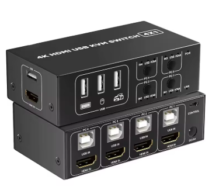

My NanoKVM exposes two UART pins which works pefectly for this. By setting up a serial connection in Python and sending the following string the KVM will switch inputs.

```
G01gA // port 1
G02gA // port 2
G03gA // port 3
G04gA // port 4
```

This solves expanding HID and video to 4 device but I'm still missing power controls such as the power button, reset button, and power LED. I probably could've gotten away with using wake-on-lan packets to power on devices, but as a System Administrator having full remote power control of my servers is a necessity.

## Custom PCBs

This is my first time using KiCad and designing PCBs/schematics/components so there are likely some things wrong. It works for me and I am happy with the results.

### Bravo Board

I took inspritation from the "NanoKVM-B" board which sits inside the computer case and connects to the Motherboard pins *and* the Case wires and designed my own in KiCad. The board I call "Bravo board" sits in the computer case as well. It uses two solid state relays and one optocoupler for the power and reset button and sensing the power LED status respectively. The Bravo board uses a standard RJ45 cable to connect back to the "Alpha board".

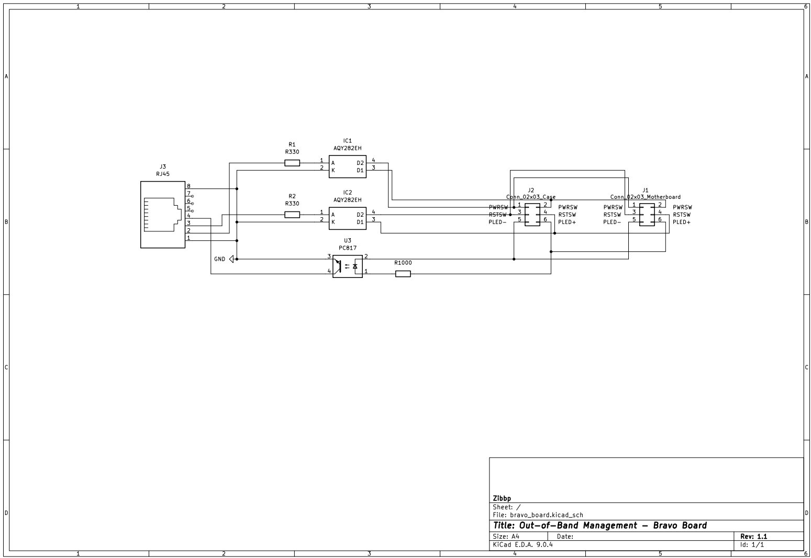

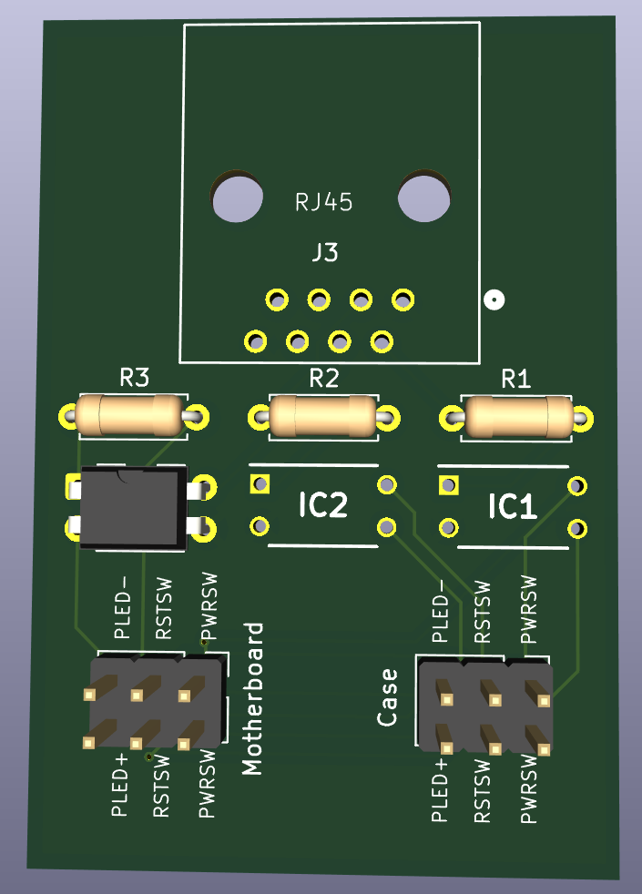

### Alpha Board

The "Alpha board" connects to four Bravo boards to control four computers over a standard ethernet cable. It uses a ESP32-C3 as the microcontroller and a GPIO expander. On the board are some status LEDs and two USB connectors for connecting to the HDMI-KVM (to switch video inputs) and optionally for controlling the Alpha board over a serial connection.

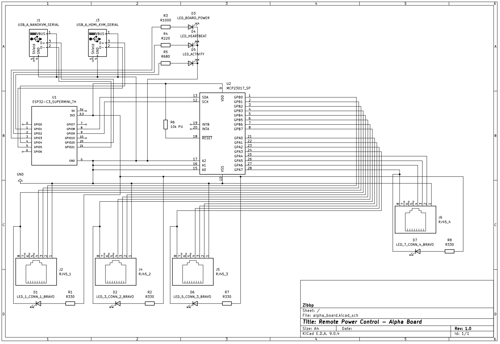

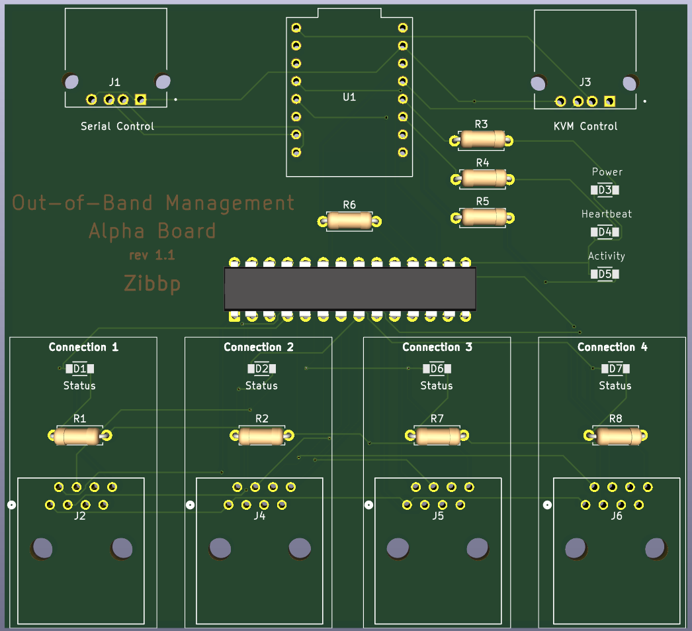

## Connecting Everything

This is how the complement OOB Management solution is wired.


Drawing of how the Alpha board connects to Bravo boards.

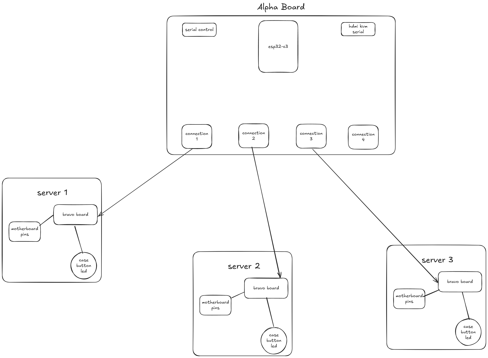

Drawing of the entire Out-of-Band Management wiring and setup.

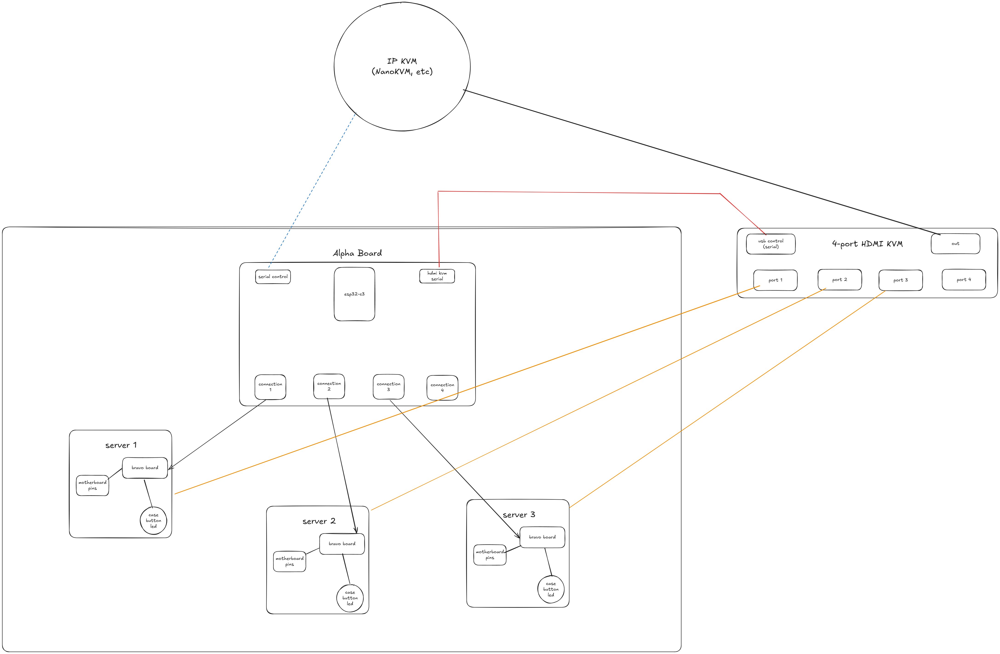

## Software

[Micropython](https://micropython.org/) is used on the ESP32-C3 to control everything.

Notable features:

- AP fallback / AP for initial WiFi setup
  - The "HeartBeat" LED will flash fast if WiFi is not configured for easy debugging
- Web UI for controlling logic
- HTTP API
- Persistent storage using ESP Non-Volatile storage for WiFi credentials and labels
- *Future* Serial API
  - A future update allowing the IP-KVM to control the Alpha board via a serial connection (or any device)
  - The WiFi WebUI/API works great for me right now though a more stable serial connection would be nice
- Activity LED that flashes when a request is processed
- Bravo connection status LEDs

Web UI image:

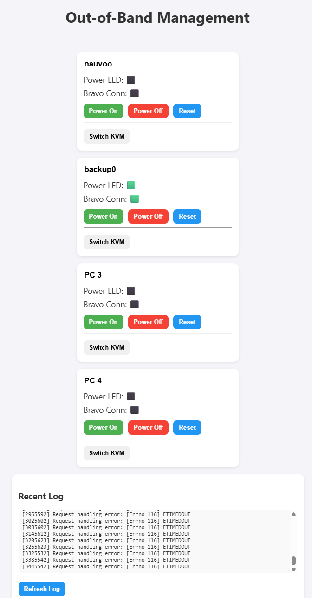

## ESP32-C3 Setup

- Install micropython on the esp32-c3
- Upload the code
  - Look at the `Makefile` for commands or run `make upload`
  - The esp32-c3 needs to be wired up to the GPIO expander for the code to run
- Connect to the Access Point it creates and setup WiFi
  - Name: `OOB-Setup-XXXX`
  - Password: `oobsetup1`
  - Web page: `192.168.4.1`
- Basic authentication
  - Default username and password is `oob`

## Summary

As an introduction into PCBs and KiCad this has been a fantastic project solving a real need. I connect the Bravo board to the computer along with an HDMI and USB cable to the HDMI KVM and I get full control of the computer, similar to IPMI/ILO. 

### Future Improvements

If I ever do a new revision I would likely make the following changes

- Use a microcontroller with ethernet or a W5500 PHY SPI interface
- Make a PCIE slot/mountable version of the Bravo board
  - The RJ45 connector might be too wide/tall

## Parts List

- ESP32-C3 (Supermini)
- SSR Relay (AQY282EH)
- Optoisolator (PC817X2NSZ9F)
- 6POS 2.54MM Pins (Digikey: 2057-PH2-06-UA-ND)
- LED RED Clear 1206 (Digikey: 160-1405-1-ND)
- LED RED Amber 1206 (Digikey: 160-1166-1-ND)
- LED Green Amber 1206 (Digikey: 160-1169-1-ND)
- LED Blue Amber 1206 (Digikey: 160-1643-1-ND)
- USB Type-A RCPT (Digikey: ED2989-ND))
- IC XPNDR 1.7MHZ I2C 28SDIP (Digikey: MCP23017-E/SP-ND)
- MODULAR JACK RJ45 8P8C (Digikey: 2057-MTJ-881X1-ND)
- The various resistors

## Finished Results

After waiting some time for the PCBs and components to arrive, it's complete! Using through-hole components made soldering easy. The small surface mount LEDs were a bit difficult to get soldered on. Here are some images of the Alpha and Bravo boards.

Complete Alpha board and four Bravo boards.

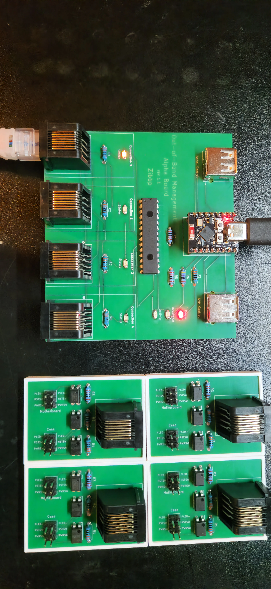

Bravo board.

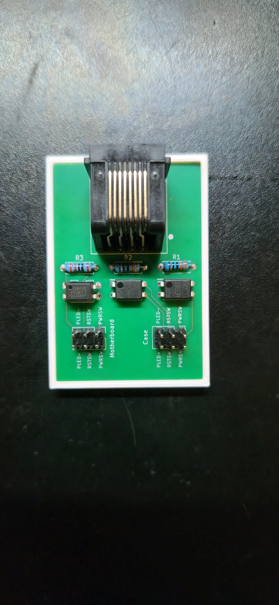

3D printed 10" tiny rack tray for the Alpha board.

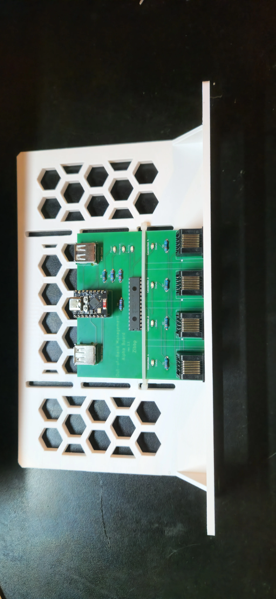

Setting up the Bravo board in a computer.

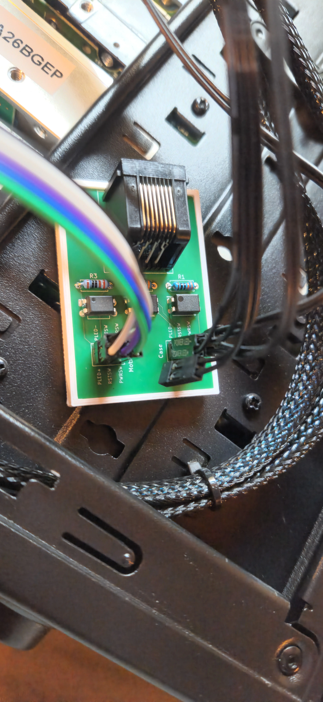

